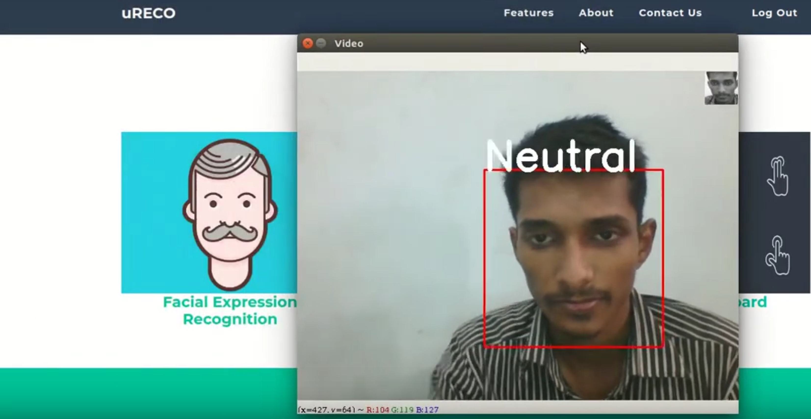
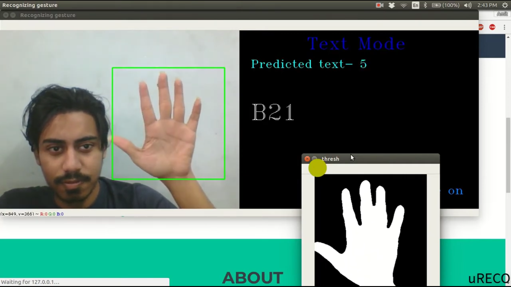
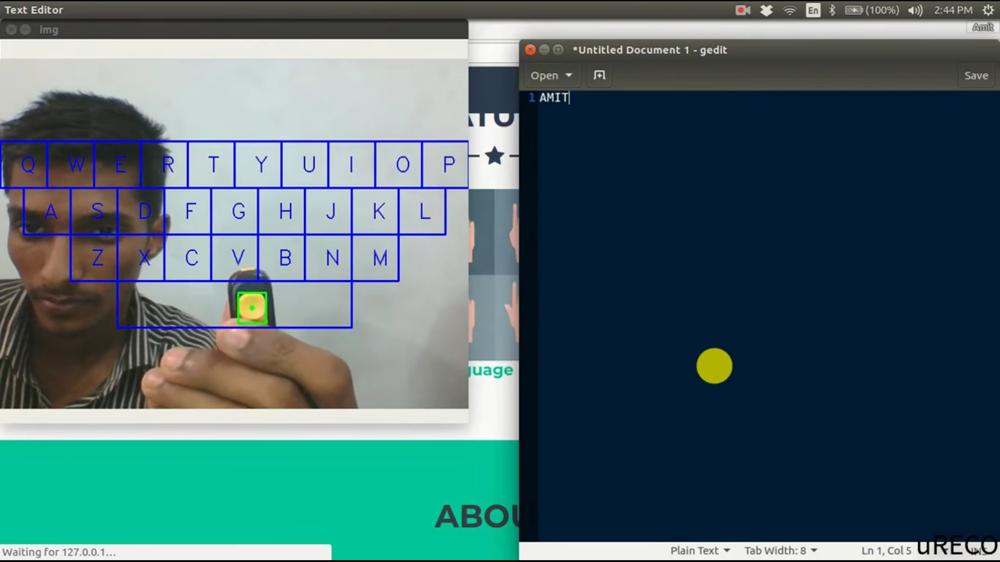

# uRECO
A web application related to image processing and gesture recognition.
[Check out the youtube video !!](https://youtu.be/nhyKpvAZZts)

**Developed by:**
- [Amit Roy](https://amitroy7781.github.io)
- [Saif Mahmud](https://saif-mahmud.github.io)
- [Tauhid Tanjim](https://github.com/Tanjim13)

**Features:**
  

- Facial Expression Classifier

- American Sign Language (ASL) Character Detection through Computer Camera

- Virtual PC Keyboard

**Platform:**
- Pycharm

**Language:**
- **BackEnd:** Python, Flask - A Python framework, Kearas, Tensorflow, OpenCv
- **FrontEnd:** HTML, CSS, Javascript,

